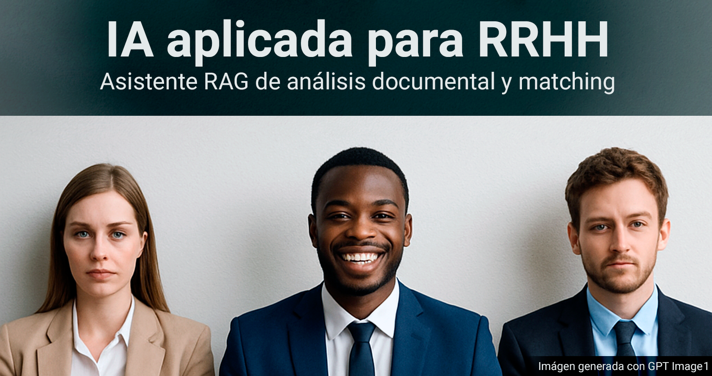
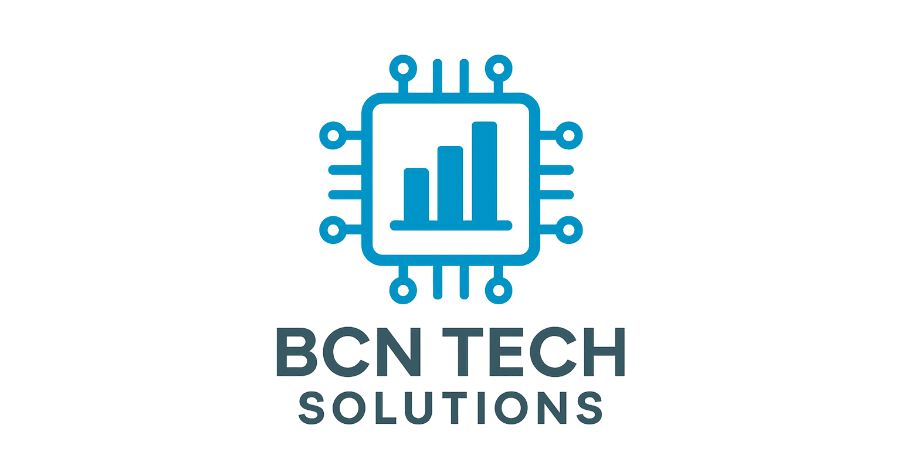
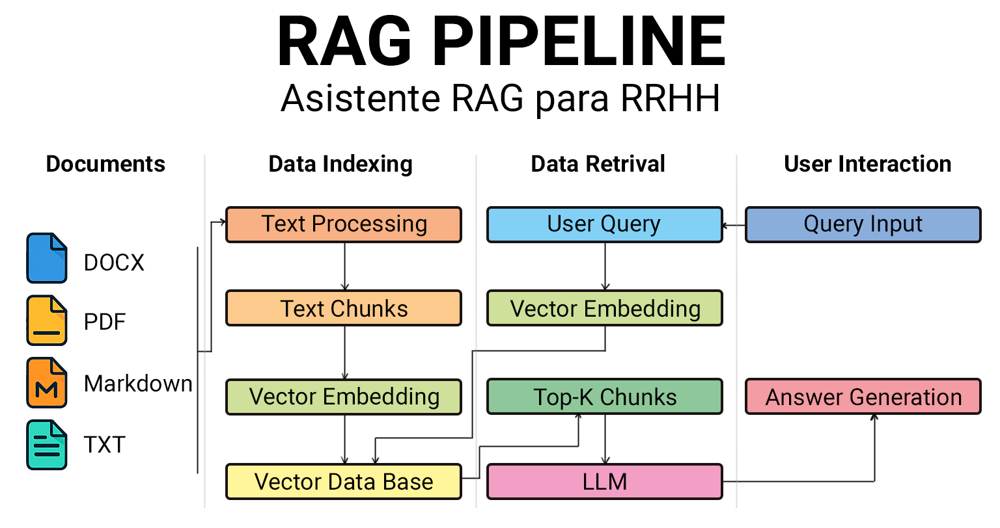
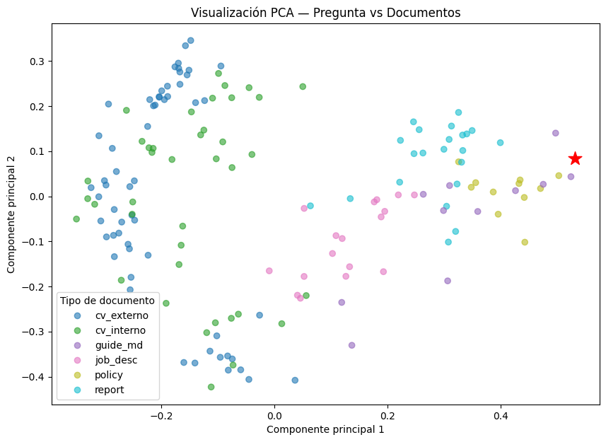

# Asistente RAG para RRHH — BCN Tech Solutions

Este proyecto forma parte del **Trabajo Final de Máster en Data Science e Inteligencia Artificial**, desarrollado por **David Martínez Martín**.  
El objetivo ha sido construir un **sistema RAG (Retrieval-Augmented Generation)** capaz de **consultar, analizar y generar respuestas** a partir de documentos reales del área de **Recursos Humanos (RRHH)** dentro de una empresa simulada llamada **BCN Tech Solutions**.

## Acceso al Notebook completo

Puedes explorar y ejecutar el proyecto íntegro desde Google Colab:  
**[Abrir notebook en Colab](https://colab.research.google.com/drive/1_po4KRbvx0rT8_L3A2SeTea4jsJuVOvI?usp=sharing)**

## Descripción general

El asistente permite **formular preguntas en lenguaje natural** y obtener respuestas precisas basadas en documentación interna de RRHH, como políticas corporativas, descripciones de puesto, evaluaciones de desempeño y currículums de empleados.  
El sistema combina **búsqueda semántica (FAISS)** y **modelos de lenguaje (LLMs)** para ofrecer resultados relevantes y contextualizados.

## Pipeline del sistema

El flujo completo del asistente se basa en la arquitectura **RAG (Retrieval-Augmented Generation)**, con las siguientes etapas:

### 1. Ingesta documental
- Lectura de archivos en formato **PDF**, **DOCX** y **Markdown**.
- Limpieza y normalización de texto mediante `BeautifulSoup`, `markdown` y `PyMuPDF`.

### 2. Chunking y vectorización
- División adaptativa de documentos en fragmentos equilibrados (`chars` y `doctype`).
- Generación de **embeddings** con modelos locales y OpenAI (`MiniLM`, `MPNet`, `OAI-1536`, `OAI-3072`).
- Almacenamiento vectorial con **FAISS** para búsquedas eficientes.

### 3. Recuperación y generación
- Búsqueda semántica (`top-k`) para seleccionar los fragmentos más relevantes.
- Generación de respuestas con un **LLM (GPT-4o-mini)**, guiado por el contexto recuperado.
- Evaluación mediante métricas **Hit@K**, **MRR** y **nDCG@K**.

### 4. Visualización y evaluación
- Representación 2D de los embeddings con **PCA** para analizar la separación semántica de los documentos.

## Modelos y herramientas utilizadas

| Tipo | Herramienta / Modelo | Descripción |
|------|-----------------------|--------------|
| **Embeddings** | `all-MiniLM-L6-v2`, `all-mpnet-base-v2`, `text-embedding-3-small`, `text-embedding-3-large` | Modelos de Sentence Transformers y OpenAI |
| **Vector DB** | `FAISS` | Búsqueda semántica rápida en espacios vectoriales |
| **LLM** | `GPT-4o-mini` | Generación de respuestas contextualizadas |
| **Procesamiento** | `PyMuPDF`, `python-docx`, `BeautifulSoup`, `markdown` | Limpieza y extracción de texto |
| **Visualización** | `matplotlib`, `seaborn`, `wordcloud`, `PCA` | Análisis visual y explicativo |
| **Evaluación** | `sklearn.metrics` (nDCG, cosine_similarity) | Evaluación cuantitativa de la recuperación |

## Resultados destacados

- Los **embeddings de OpenAI (`text-embedding-3-large`)** ofrecieron los mejores resultados:
  - `Hit@K = 1.0`  
  - `nDCG@K ≈ 0.76`  
  - `MRR ≈ 0.65`
- El espacio de chunking `chars` mostró mejor rendimiento que `doctype` en términos de ordenación semántica.
- Las respuestas generadas con LLM fueron **coherentes, contextuales y verificables** respecto a los documentos fuente.

## Valor y conclusiones

El sistema demuestra cómo un pipeline RAG puede **optimizar la gestión documental en RRHH**, reduciendo tiempo de búsqueda y mejorando la precisión en la toma de decisiones.  
Además, integra una **evaluación cuantitativa y cualitativa** que permite medir objetivamente la calidad del modelo y su impacto operativo.

